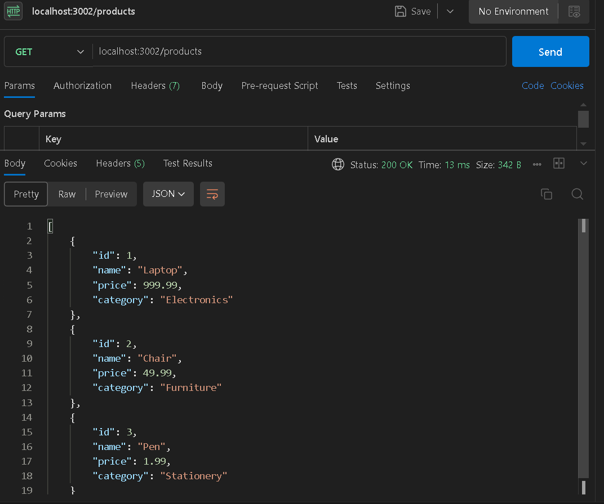
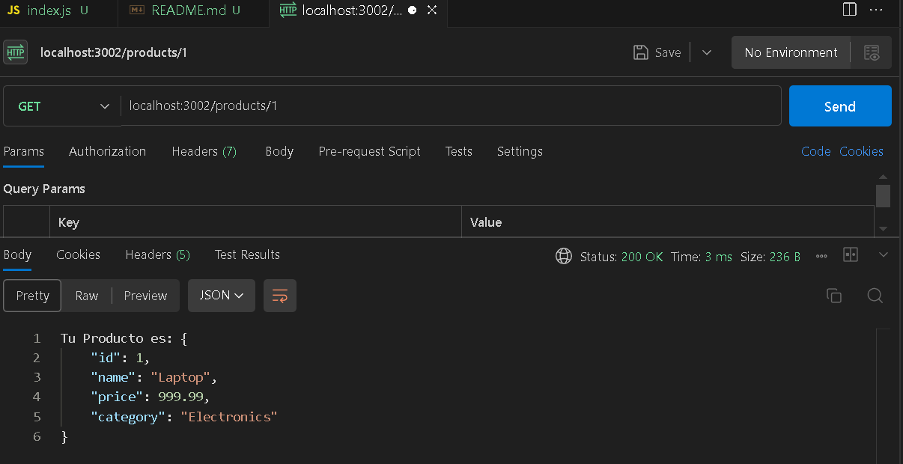
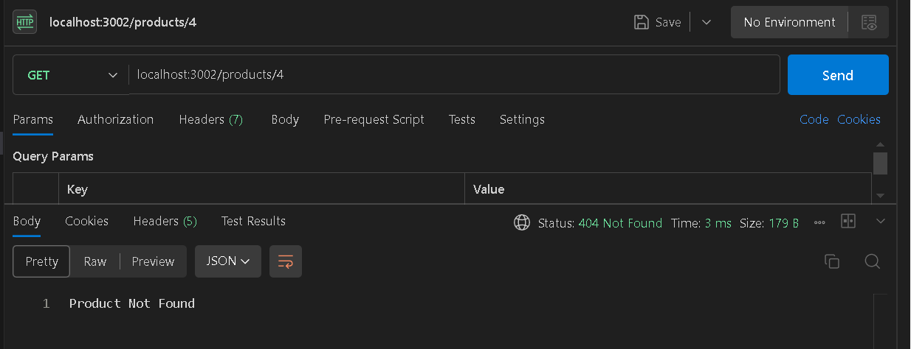

# Products API

Esta es una pequeña API que gestiona una lista de productos. La API permite obtener todos los productos y obtener un producto por su ID.

## Instalación

1. Crear la carpeta del proyecto en VS Code.
2. Ejecutar `npm install` para instalar las dependencias necesarias.
En este caso en el bash se usaron los comandos:

```bash
 npm init -y
 npm --save-dev nodemon
```
El comando "npm init -y" se utilizó estando ubicado en la ccarpeta del proyecto para crear el archivo package.json

El comando " npm --save-dev nodemon" para instalar nodemon aunque este no es obligatorio.

en package.json se modificó agregando el "type", el "start" y el "dev" tal coo se smuestra a continuación.

```json
    {
        "name": "jonnylunatarea5",
        "version": "1.0.0",
        "description": "",
        "main": "index.js",
        "type": "module",
        "scripts": {
            "start": "node index.js",
            "dev": "nodemon index.js ",
            "test": "echo \"Error: no test specified\" && exit 1"
        },
        "keywords": [],
        "author": "",
        "license": "ISC",
        "devDependencies": {
            "nodemon": "^3.1.7"
        }
    }
```

3. Corre el servidor con el siguiente comando:

   ```bash
   npm run dev
   ```
# Endpoints

Para usar nuestra API de products se utilizó Postman en VS Code pero tambien se ppuede descargar la aplicación y probar en el computador con los siguientes pasos:

### Obtener todos los productos.

URL: /products.

Método: GET.

Descripción: Retorna la lista completa de productos.

Ejemplo de respuesta:



### Obtener un producto por ID

URL: /products/:id

Método: GET

Descripción: Retorna un producto específico por ID.

Ejemplo de respuesta para el producto 1:



Si se desea probar con otro id solo se necesita cambiar el id "1" por el id deseado. 

Ejemplo de respuesta para el producto 4 (No existe):




