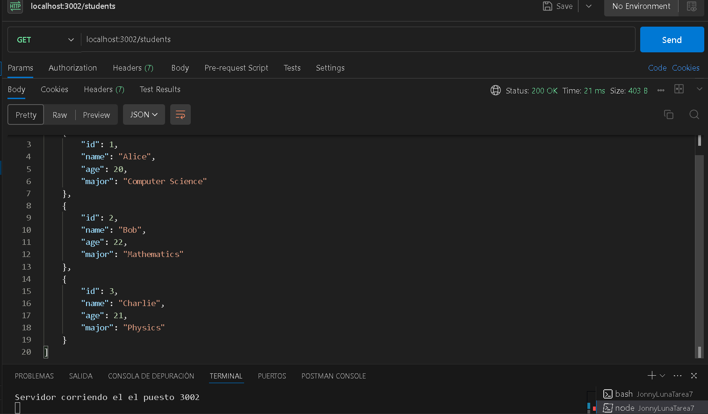
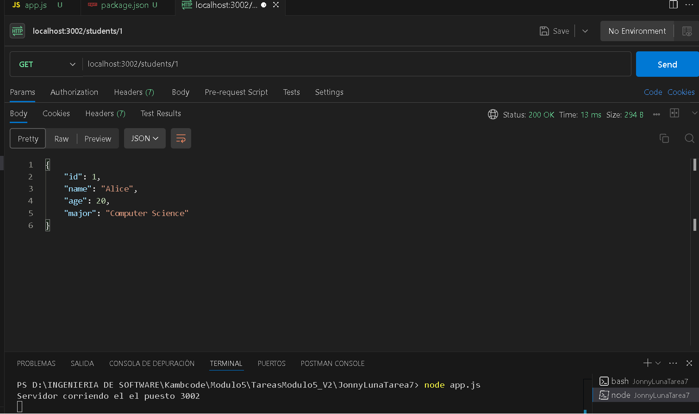
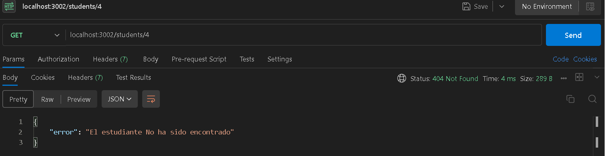
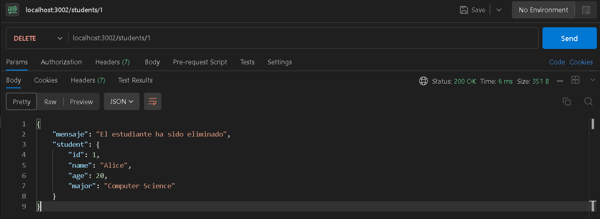
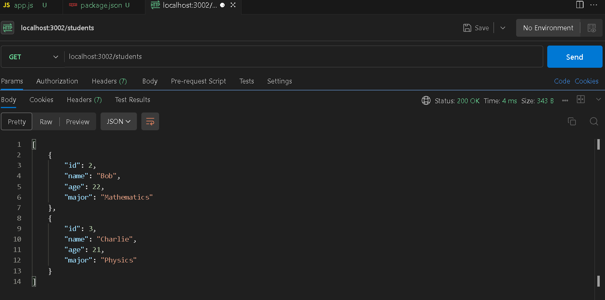

# API de Gestión de Estudiantes

Esta es una API sencilla que permite gestionar una lista de estudiantes. Proporciona funcionalidades para obtener la lista de estudiantes, obtener un estudiante específico por ID, y eliminar un estudiante por ID.

## Tecnologías utilizadas

- **Node.js**
- **Express.js**

## Instalación

1. Clona este repositorio.
2. Asegúrate de tener Node.js instalado en tu máquina.
3. Instala las dependencias necesarias ejecutando:

    ```bash
    npm install
    ```

## Cómo ejecutar el proyecto

1. Ejecuta el siguiente comando para iniciar el servidor:

    ```bash
    node app.js
    ```

2. El servidor se ejecutará en el puerto `3002`. Para comprobar que funciona correctamente, abre tu navegador o Postman y ve a `http://localhost:3002`.

## Endpoints disponibles

### GET `/`

Este endpoint devuelve un mensaje de bienvenida.

- **URL**: `/`
- **Método**: `GET`
- **Respuesta**: 

    ```json
    Bienvenido a mi web de estudiantes
    ```

### GET `/students`

Este endpoint devuelve la lista completa de estudiantes en formato JSON.

- **URL**: `/students`
- **Método**: `GET`
- **Respuesta**:



### GET `/students/:id`

Este endpoint devuelve los detalles de un estudiante específico basado en su ID.

- **URL**: `/students/:id`
- **Método**: `GET`
- **Parámetro**: `id` (número del estudiante)
- **Respuesta exitosa**: 




- **Respuesta de error (si el estudiante no existe)**:



### DELETE `/students/:id`

Este endpoint permite eliminar a un estudiante específico por su ID.

- **URL**: `/students/:id`
- **Método**: `DELETE`
- **Parámetro**: `id` (número del estudiante)
- **Respuesta exitosa**:



- **Respuesta donde se verifica estudiante eliminado**:



## Estructura del proyecto

- `app.js`: Contiene el código que inicia el servidor en el puerto 3002.
- `server.js`: Contiene toda la lógica de los endpoints y la lista de estudiantes.

## Ejemplos de uso

Puedes probar los endpoints utilizando herramientas como [Postman](https://www.postman.com/) o `curl` desde la línea de comandos.

Ejemplo para obtener todos los estudiantes:

```bash
GET  http://localhost:3002/students
```

Tambien se realizó el punto opcional utilizando un archivo .json el cual arroja el mismo resultado con los mismos endpoints.


