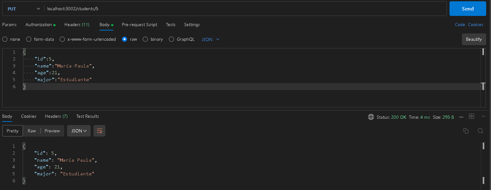

# TAREA 8 MIDDLEWARES
Este proyecto es una API que gestiona información de estudiantes utilizando Express como framework de Node.js. Implementa middlewares para autorización y validación de datos en las rutas correspondientes.

**instala las dependencias del proyecto**

```bash
npm install
```
**Ejecuta el servidor**

```bash
node app.js
```
El servidor estará escuchando por el puerto 3002

## Parte 1. Implementación de Middleware de Autorización

### Prueba de Bearer Token 

**Método GET**


**Método POST**


**Método PUT**

  

Verificación del cambio en el **name** estudiante con id = 5  


**Método DELETE**

eliminamos el estudiante con id = 4


verificamos con una petición GET que el estudiante con id = 4 fue eliminado.  


## Parte 2

### Pruebas

**Método POST**

Con datos válidos  


Con datos No válidos  
Nombre vacío  


Edad en string  


Major vacío  


**Método PUT**

Con datos correctos  
modifica el name  


Nombre vacío  


Edad como String  


Major vacío  


